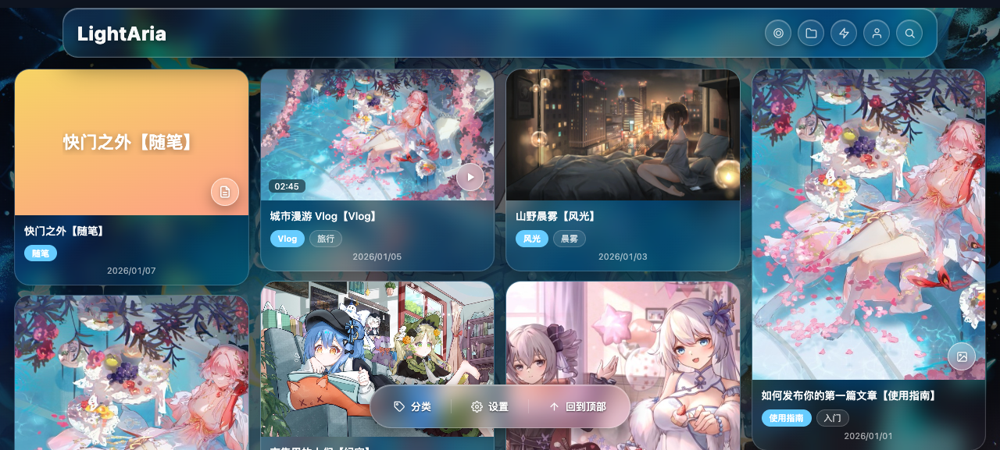
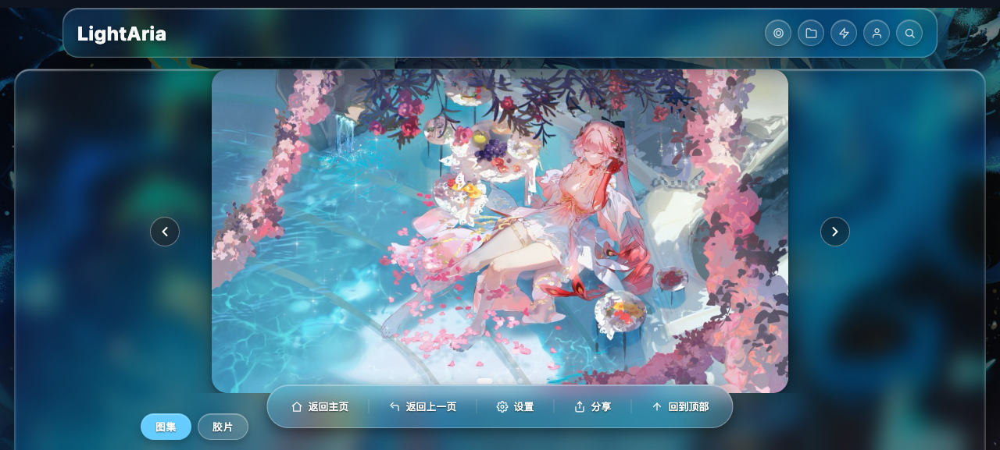
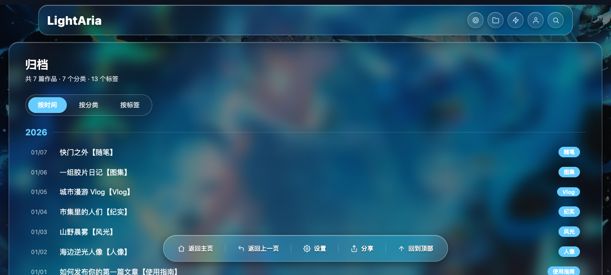
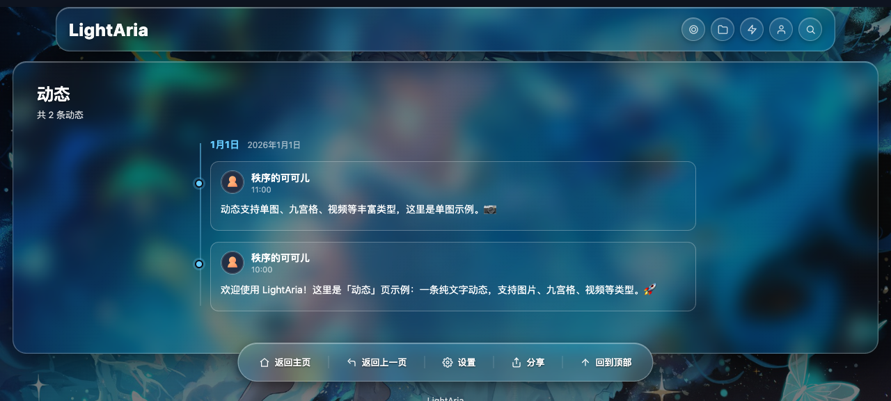
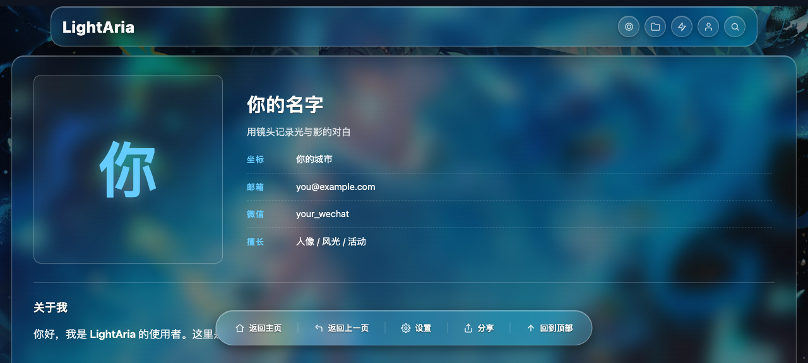

# 重要声明：本项目为纯AI项目，存在一定的未知bug和不完善的地方，主要供个人学习使用
# LightAria 

> 可用于展示传媒作品集静态博客

一个开箱即用的**摄影作品集静态博客**，基于 [Astro](https://astro.build) 构建，液态玻璃（Glassmorphism）视觉风格，深色沉浸式体验，适配手机与桌面端。





### 更多页面







## ✨ 特性

- 📱 **小红书式信息流**：网格瀑布流 / 列表 / 简洁三种布局，桌面与手机可分别设置
- 🖼 **图集模式**：`images` 字段 2 张及以上自动渲染左右滑动轮播（触摸滑动 + 箭头 + 圆点）
- 🎬 **视频模式**：文章顶部视频播放器，卡片显示播放按钮与时长
- 🧊 **液态玻璃视觉**：半透明模糊卡片、深色沉浸式无边框观感、柔和光影
- 🎨 **一键换肤**：主题色、背景图、玻璃模糊度、背景亮度、字号全部可在设置面板调节并本地记忆
- 🏷 **智能分类**：标题 `【分类】` 自动识别，或 `category` 字段显式指定
- 📑 **归档三视图**：按时间 / 按分类 / 按标签筛选
- 💬 **动态页**：纯文字 / 单图 / 九宫格 / 视频等动态类型
- 🔗 **友情链接 / 个人主页**：预留完善的展示页
- 🌐 **快速分享**：一键生成分享卡片（封面 + 标题 + 二维码）
- ⚡ **性能**：图片懒加载 + 加载淡入，滚动流畅无闪动

## 🚀 快速开始

```bash
npm install       # 安装依赖
npm run dev       # 本地开发 http://localhost:4321
npm run build     # 构建静态站点（输出 dist/）
npm run preview   # 本地预览构建产物
```

部署：将 `dist/` 目录部署到任意静态托管平台（Cloudflare Pages / Netlify / Vercel / 自有服务器）。

## 📝 发布文章

在 `src/content/works/` 下新建文件夹（文件夹名即分类），放入 `.md` 文件：

```markdown
---
title: "【人像】夏日海边写真"
tag: 人像
category: "人像"          # 选填，优先级高于标题【】
date: 2026-06-18
type: photo                # photo | video
cover: "/images/cover.jpg" # 选填，不填则用标题生成封面
ratio: "3/4"               # 封面比例，默认 8/5
desc: "作品描述"
likes: 0
tags: [人像, 胶片]
images:                    # 图集模式（≥2 张左右滑动）
  - "/images/1.jpg"
  - "/images/2.jpg"
---

这里是正文（Markdown），展示在轮播/封面下方。
```

- 本地图片放 `public/`，引用 `/images/xxx.jpg`
- 图集：`images` 数组 ≥2 张自动轮播，第一张决定容器比例，卡片封面取第一张
- 视频：`type: video` + `video` 直链 + 可选 `duration`

## ⚙️ 自定义配置

所有站点配置集中在 [`src/config/site.ts`](src/config/site.ts)：

| 配置 | 说明 |
|---|---|
| `title` / `brand` / `subtitle` | 站点标题与品牌 |
| `background` / `showBackground` | 背景图与开关 |
| `theme.accent` | 主题强调色 |
| `user` / `profile` | 分享卡片与个人主页信息 |
| `layoutDesktop` / `layoutMobile` | 默认布局 |
| `style` / `glassBlur` / `bgDim` / `mdFontSize` | 默认样式与设置项默认值 |
| `autoCategoryFromTitle` | 标题【】自动分类开关 |
| `comments` | 评论系统（预留 Twikoo / Waline / Artalk） |
| `friends` | 友情链接 |
| `pages` | 页面开关（隐藏导航按钮） |

个人主页文案：`src/content/about/about.md`。动态：`src/content/moments/`。

## 📂 目录结构

```
src/
├── components/        # UI 组件（卡片/弹层/分享等）
├── content/
│   ├── works/         # 文章（文件夹 = 分类）
│   ├── moments/       # 动态
│   └── about/         # 个人主页文案
├── layouts/           # 布局与主脚本
├── pages/             # 页面（首页/归档/动态/友链/关于/错误页）
├── styles/            # 全局样式（液态玻璃主题变量）
└── config/site.ts     # 站点配置（自定义入口）
```

## 🛠 技术栈

- [Astro](https://astro.build)（静态站点框架，MIT 开源）
- 原生 CSS + 少量原生 JS（无前端框架依赖）
- TypeScript

## 📄 License

[MIT](LICENSE)
